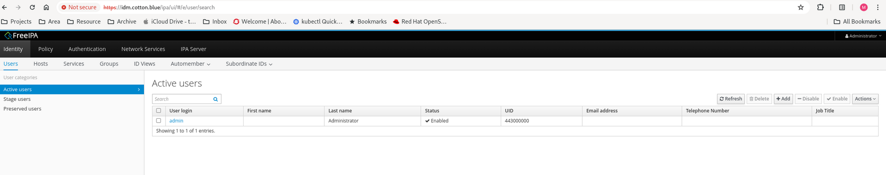
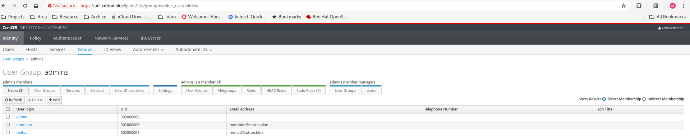
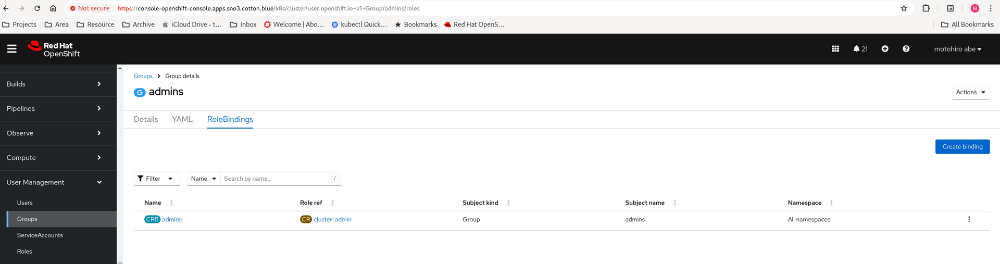
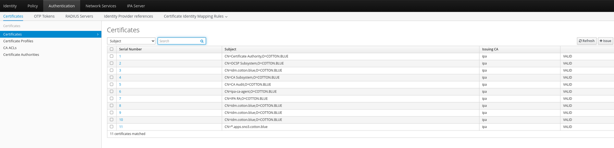

# OCP integration with Redhat IDM (freeipa)
In a closed network, there might be cases where you want to quickly set up management for users and cluster certification. We can achieve this by using Red Hat IDM and integrating it with our OpenShift cluster. Here, I am going to introduce how to set up the IDM service and use it as an OAuth provider and ACME provider. This approach allows you to quickly set up infrastructure services in a lab environment, which can sometimes be troublesome to demonstrate if you use third-party providers and publically available ACME providers.

## How to install IDM
For lab setup, the easiest way is to use the Fedora distribution. In this blog, I am going to use Fedora 39, which installs the upstream version of IDM.

There is an issue regarding requesting wildcard support in ACME, which is currently broken. To workaround this in the blog, I am going to rebuild the dogtag-pki-acme components. If the upstream fixes the issue, this step will not be necessary. Please note that this step is only for lab purposes and has not been fully tested.

### Rebuildng Dogtag-PKI-ACME

First, set up the RPM build environment:

````

sudo dnf install rpm-build
sudo dnf install rpmdevtools
rpmdev-setuptree

````

#### Installing the Source RPM
Next, download the source package and move it to the SRPMS folder:

````
dnf download --source dogtag-pki-acme
mv dogtag-pki-11.4.3-2.fc39.1.src.rpm ./rpmbuild/SRPMS/
````

#### Extract the source Files
Navigate to the RPM build directory and extract the source files:

````
cd ~/rpmbuild/SRPMS/
rpm -ivh
rpm -ivh dogtag-pki-11.4.3-2.fc39.1.src.rpm
````

#### Untar the Source and Update the Code

````
cd ~/rpmbuild/SOURCE/
rm -rf pki-11.4.3.tar.gz  # delete original .gz file
````

To update the file, you can follow these steps:
Refer to https://github.com/dogtagpki/pki/pull/4715/files

```
./pki-11-4.3/base/acme/src/main/java/org/dogtagpki/acme/server/ACMEIdentifierValidator.java
```

This will compress the pki-11.4.3 directory into a tarball named pki-11.4.3.tar.gz.

````
cd ~/rpmbuild/SOURCE/
tar -cvf pki-11.4.3.tar.gz ./pki-11.4.3
````

#### Building the Package
Once the source files are extracted and updated, you can rebuild the package using rpmbuild:
````
rpmbuild -ba ~/rpmbuild/SPECS/dogtag-pki.spec
````

This will generate RPMs under ~/rpmbuild/RPMS/noarch.

Install the rebuilt RPM package using dnf:
````
 sudo dnf install dogtag-pki-acme-11.4.3-2.fc39.1.noarch.rpm
````

## Installing IPA Server and Configuring

````
dnf install ipa-server
````

In this lab, an external DNS server is used, so make sure there is an A record for the IPA server in the DNS.

Then, follow the "Installing an IdM server: Without integrated DNS, with an integrated CA as the root CA" chapter in the [product documentation](https://access.redhat.com/documentation/en-us/red_hat_enterprise_linux/9/html-single/installing_identity_management/index#assembly_installing-an-ipa-server-without-dns-with-external-ca_installing-identity-management):

````
ipa-server-install
````

Ensure that firewalld is configured as per the product documentation. Once everything is set up correctly, you should be able to access the FreeIPA GUI at http://<IDM.FQDN>.



## Integrating OpenShift LDAP Identity Provider with the IDM Service

You can find the LDAP endpoint information in the /etc/openldap/ldap.conf file:

````
[root@idm ~]# cat /etc/openldap/ldap.conf
--- ommit ---
URI ldaps://idm.cotton.blue
BASE dc=cotton,dc=blue
SASL_MECH GSSAPI
````

#### Installing and Configuring the Group Sync Operator
To provision a user with groups, we need to install and configure the Group Sync Operator. Start by updating the baseDN and whitelist parameters in the groupsync.yaml file to match your environment.

````
oc apply -f groupsync.yaml
````

After installing the Group Sync Operator, create a group (or use an existing one, such as the admin group in the IPA), and then create a cluster role binding in OpenShift to assign appropriate permissions.

These steps enable synchronization of groups between the IDM service and OpenShift, facilitating user management and access control.





Now, you can create a user in the IDM and assign them to the admin group. Once done, the user will be able to log in to the cluster with the cluster-admin role.

# Certification Manager Integration with ACME Provider Service in the IPA Server

To integrate Certification Manager with the ACME provider service in the IPA server, follow these steps:

Install cert-manager according to the instructions provided in the [product document](https://docs.openshift.com/container-platform/4.13/security/cert_manager_operator/cert-manager-operator-install.html).


## Configuring an ACME Issuer with IPA Server
In this example, we will configure an ACME issuer using the IPA server. Follow these steps:

### Enabling the ACME Service in IdM
By default, the ACME service is deployed but disabled in IPA. You can enable it using the following command:

````
# ipa-acme-manage enable
The ipa-acme-manage command was successful
````

### Enabling Wildcard Support
To enable wildcard support, edit the /etc/pki/pki-tomcat/acme/engine.conf file and set policy.wildcard=true. After updating the configuration, reboot the server for the changes to take effect.

````
# Whether to accept wildcard DNS identifiers:
policy.wildcard=true
````

### Creating a Cluster Issuer
On the OpenShift cluster, create a cluster issuer using the following commands. First, create the secret by obtaining the username and password from the /etc/pki/pki-tomcat/acme/issuer.conf file on the IPA server:

````
[root@idm acme]# cat issuer.conf
# VERSION 2 - DO NOT REMOVE THIS LINE
class=org.dogtagpki.acme.issuer.PKIIssuer
url=https://idm.cotton.blue:8443
profile=acmeIPAServerCert
username=acme-idm.cotton.blue
password=1Kt{p3Rf+OaPz+dck~YuWd@AKt,Wf.mTQUbFKn~+p
````

On the cluster, you'll create a secret and a cluster issuer:

````
oc apply -f idm-secret.yaml
oc apply -f acme-cluster-issuer.yaml
````

Check the status of the cluster issuer:
````
oc get clusterissuers.cert-manager.io idm-staging
NAME          READY   AGE
idm-staging   True    5h10m

````
You should see the issuer marked as ready.<br>
Next, request a new certificate using the following YAML as an example:

````
apiVersion: cert-manager.io/v1
kind: Certificate
metadata:
  name: sno3-cert-mgr-wild-new-idm
  namespace: openshift-ingress
spec:
  isCA: false
  commonName: "apps.sno3.cotton.blue"
  secretName: sno3-cert-mgr-secret-wild-new-idm
  dnsNames:
  - "*.apps.sno3.cotton.blue"
  - "apps.sno3.cotton.blue"
  issuerRef:
    name: new-idm-staging
    kind: ClusterIssuer
````

Monitor the creation of the certificate request. It should become ready in a few minutes:

`````
$ oc get certificate -w -n openshift-ingress
NAME                         READY   SECRET                              AGE
sno3-cert-mgr-wild-new-idm   True    sno3-cert-mgr-secret-wild-new-idm   4h33m
`````

Once the certificate is ready, you should be able to see the new certificate with wildcard support in the IPA GUI.

)

To update the ingress certificate with the new certificate, you can follow the steps outlined in the provided [product documentation](https://docs.openshift.com/container-platform/4.13/security/certificates/replacing-default-ingress-certificate.html
).

Find the secret corresponding to your new certificate created by the certificate request, then Update the ingress controller.  Please update root CA as well.

````
 oc patch ingresscontroller.operator default \
     --type=merge -p \
     '{"spec":{"defaultCertificate": {"name": "<secret>"}}}' \
     -n openshift-ingress-operator
````

